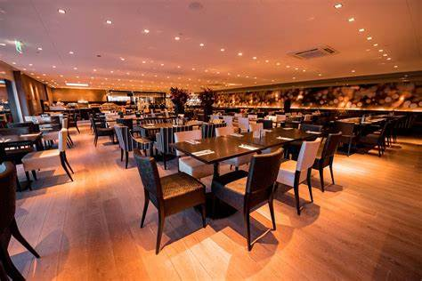
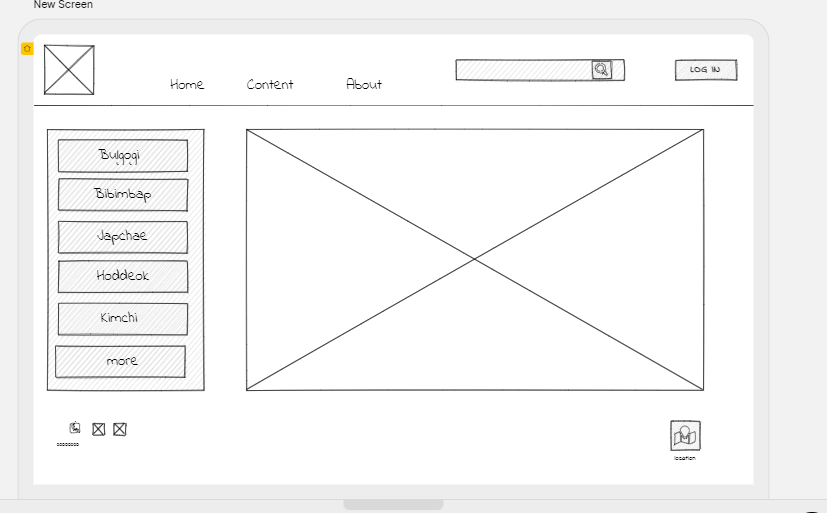

# my-restaurant
my restaurant website
[live server](https://amanialsmadi.github.io/my-restaurant/)

# love korea restaurant 

## korean dishes

- **Bulgogi**  Marinated grilled meat
- **Bibimbap**  Meat, rice, vegetables, soy sauce
- **Japchae** Fried noodles with meat and vegetables
- **Hoddeok** Korean Pancakes,Stuffed with a mixture of brown sugar, cinnamon, white honey and some crushed nuts
- **kimchi**  Fermented vegetables, with a spicy and sour flavour

 

[my github](https://github.com/AmaniAlsmadi)

 

